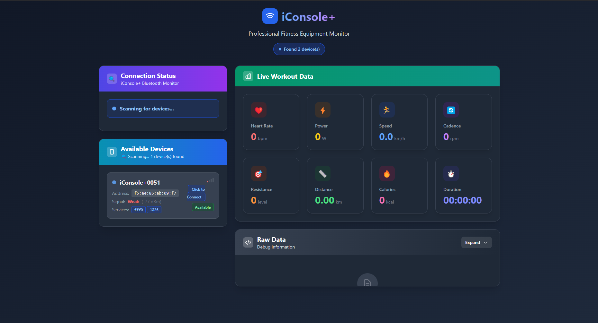

# 🚴 iConsole+ Bluetooth Client

A modern Electron application built with SolidJS for connecting to iConsole+ exercise bikes via Bluetooth and displaying real-time workout data.



## ✨ Features

- 🔗 **Bluetooth LE Connection** - Connect to iConsole+ exercise bikes
- 📊 **Real-time Data** - Live workout metrics display
- 🎛️ **Resistance Control** - Adjust bike resistance remotely (1-20 levels)
- 📹 **Session Recording** - Record and save workout sessions to JSON files
- 🤖 **AI Trainer** - Claude-powered intelligent training assistant
- 📈 **Smart Resistance** - Automatic resistance adjustments based on goals
- 💰 **Cost Tracking** - Real-time API usage and cost monitoring
- 📝 **Training History** - Complete log of AI advice and decisions
- 🎯 **FTMS Protocol** - Full FTMS (Fitness Machine Service) support
- 💻 **Cross-platform** - Works on Windows, macOS, and Linux
- 🎨 **Modern UI** - Built with SolidJS and Electron

## 📈 Supported Metrics

- ⏱️ **Workout Time** - Elapsed session time
- 🚴 **Speed** - Current cycling speed (km/h)
- 🔄 **Cadence** - Pedaling RPM
- 📏 **Distance** - Total distance traveled
- 🔥 **Calories** - Calories burned
- 💓 **Heart Rate** - BPM (when sensor connected)
- ⚡ **Power** - Instantaneous power output (watts)
- 🎚️ **Resistance** - Current resistance level

## 🚀 Quick Start

### Prerequisites

- Node.js 16+
- npm or yarn
- Bluetooth LE compatible device

### Installation

```bash
# Clone the repository
git clone https://github.com/BostonLeeK/iconsole-plus-client.git
cd iconsole-client

# Install dependencies
npm install

# Start the development server
npm start
```

### Building

```bash
# Build for production
npm run build

# Package for distribution
npm run package
```

## 🔧 Usage

1. **Launch the application**
2. **Enable Bluetooth** on your device
3. **Power on** your iConsole+ exercise bike
4. **Click "Scan"** to discover nearby devices
5. **Select your bike** from the list
6. **Connect** and start your workout!
7. **Control resistance** using the slider (1-20 levels)
8. **Configure AI Trainer** in settings with your Claude API key
9. **Select training style** and goals for personalized coaching

### 📹 Recording Workout Sessions

1. **Connect to your exercise bike**
2. **Click "Start Recording"** - all metrics will reset to zero
3. **Exercise** - data is automatically captured every second
4. **Click "Stop Recording"** - session is saved as JSON file

Recorded sessions are saved to:

- **Windows**: `%APPDATA%/iconsole-plus-client/data_records/`
- **macOS**: `~/Library/Application Support/iconsole-plus-client/data_records/`
- **Linux**: `~/.config/iconsole-plus-client/data_records/`

### 🤖 AI Personal Trainer

The AI Trainer provides intelligent, real-time coaching using Claude AI to optimize your workout experience.

#### Setup

1. **Get Claude API Key** from [Anthropic Console](https://console.anthropic.com)
2. **Add API Key** in application settings
3. **Select Training Goal**: Casual, Weight Loss, Warm-up, or Endurance
4. **Choose Ride Style**: City, Suburban, Countryside, or Track
5. **Turn On AI Trainer** and start your session

#### Features

- **Real-time Analysis** - AI evaluates your performance every 30 seconds
- **Smart Resistance** - Automatic adjustments based on your metrics and goals
- **Personalized Advice** - Contextual coaching tips and encouragement
- **Session History** - Complete log of all AI decisions and advice
- **Cost Tracking** - Monitor API usage and estimated costs in real-time
- **Goal-based Training** - Different strategies for each training objective

#### Training Goals

- **🚶 Casual**: Light resistance (3-8), comfort-focused
- **🔥 Weight Loss**: Heart rate 120-140 BPM, optimal fat burning
- **🏃 Warm-up**: Gradual resistance increase, prep for intense training
- **💪 Endurance**: Medium resistance (8-15), steady pace maintenance

#### Ride Styles

- **🏙️ City**: Variable resistance, simulates traffic and stops
- **🏘️ Suburban**: Steady pace with small hills
- **🌾 Countryside**: Long distances, varied terrain challenges
- **🏁 Track**: High intensity (12-18), speed and power focused

## 📋 Supported Devices

- iConsole+ exercise bikes (tested with iConsole+0051)
- Any FTMS-compatible fitness equipment

## 🔍 Technical Details

This application uses the standard **FTMS (Fitness Machine Service)** Bluetooth protocol to communicate with exercise bikes. For detailed information about data parsing and protocol implementation, see our comprehensive documentation:

👉 **[FTMS Data Parsing Documentation](./FTMS_PARSING.md)**

### Key Technical Features

- **Data Service**: `1826` (FTMS) - Real-time workout data
- **Control Service**: `fff0` (Proprietary) - Resistance commands
- **Message Format**: 21-byte Indoor Bike Data packets
- **Resistance Range**: 1-20 levels with dual protocol support
- **Update Frequency**: 2-3 seconds
- **Recording Frequency**: 1-second intervals
- **AI Engine**: Claude 3 Haiku - 30-second analysis intervals
- **Cost Optimization**: $0.25/1M input, $1.25/1M output tokens
- **Platform**: Electron + SolidJS
- **Bluetooth Library**: @abandonware/noble

### Resistance Control

The application supports both proprietary and FTMS standard resistance control:

- **Primary Protocol**: Proprietary `fff0` service with `0xa6` commands
- **Fallback Protocol**: FTMS standard `0x04` resistance commands
- **Range**: 1-20 resistance levels
- **Real-time**: Immediate response to resistance changes

### Session Data Format

Each recorded session contains:

- **Session metadata** (start/end time, duration)
- **Data points** (captured every second with timestamp)
- **Summary statistics** (max/avg values for all metrics)
- **JSON format** for easy analysis and integration

## 📁 Project Structure

```
src/
├── main/                 # Electron main process
├── renderer/            # SolidJS renderer
│   ├── components/      # UI components
│   ├── modules/         # Feature modules
│   └── stores/          # State management
├── services/            # Bluetooth & data services
└── types/              # TypeScript definitions
```

## 🤝 Contributing

Contributions are welcome! Please feel free to submit a Pull Request. For major changes, please open an issue first to discuss what you would like to change.

### Development

```bash
# Install dependencies
npm install

# Start development mode
npm run dev

# Run tests
npm test

# Lint code
npm run lint
```

## 📝 License

This project is licensed under the MIT License - see the [LICENSE](LICENSE) file for details.

## 🙏 Acknowledgments

- iConsole+ for creating quality exercise equipment
- The Bluetooth SIG for the FTMS specification
- The open-source community for excellent libraries

## 📋 TODO & Roadmap

### 🎯 Planned Features

- **📊 Workout Analytics** - Visual charts and graphs for session analysis

  - Historical performance trends
  - Progress tracking over time
  - Comparative analysis between sessions
  - Export data to fitness platforms

- **🔬 Advanced AI Analysis** - Enhanced AI capabilities

  - Post-workout performance analysis
  - Training recommendations based on historical data
  - Personalized training programs
  - Integration with fitness goals and metrics

- **📅 Training Planner** - Structured workout scheduling
  - Create custom training plans
  - Weekly/monthly training schedules
  - Progress milestones and achievements
  - Integration with calendar apps

### 🚀 Future Enhancements

- Multiple device support
- Cloud sync for training data
- Social features and challenges
- Integration with popular fitness apps
- Voice commands for hands-free control

## 📞 Support

If you encounter any issues or have questions:

1. Check the [FTMS Parsing Documentation](./FTMS_PARSING.md)
2. Search existing [GitHub Issues](https://github.com/BostonLeeK/iconsole-plus-client/issues)
3. Create a new issue with detailed information

---

**Made with ❤️ for the fitness community**
